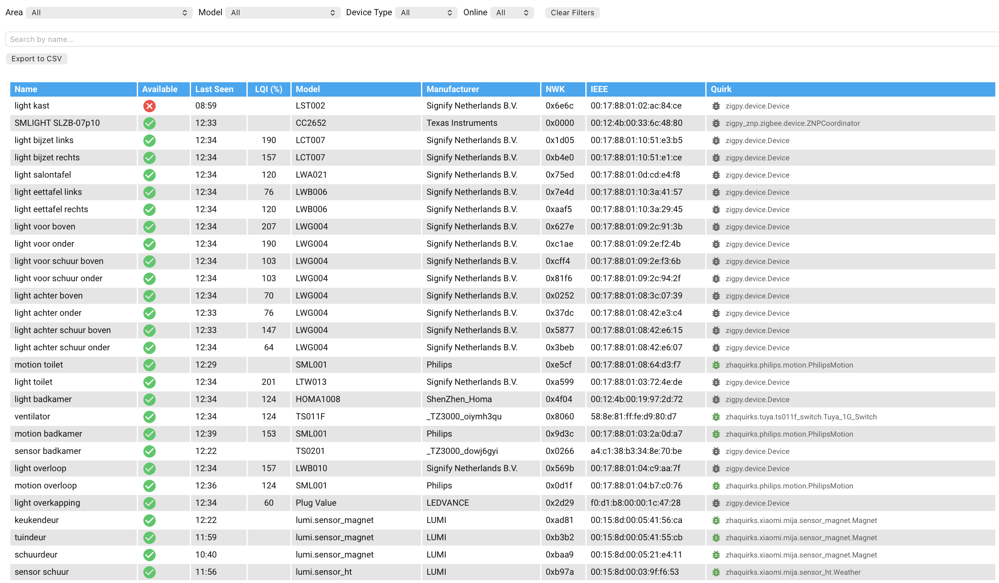

# ZHA Network Card - Extended (`zha-network-card-ext`)

This is an **extended version** of the excellent [`zha-network-card`](https://github.com/dmulcahey/zha-network-card) created by [@dmulcahey](https://github.com/dmulcahey), which allows you to **visualize and monitor your Zigbee devices** via ZHA (Zigbee Home Assistant integration).

> ⚠️ This version is not officially maintained by the original author and adds several features not available in the original card.

## ✨ Why this version

The original card was great but lacked some advanced functionality required for monitoring a large or complex Zigbee network effectively. This fork adds:

- Filtering by area, model, device type, online status, and name
- Persistent sorting and filters across reloads
- Visual indication of active filters
- Export to CSV
- Integration with sensor-based average LQI and RSSI values
- Enhanced routing and neighbor display
- Improved responsive layout and styling



## 🙏 Acknowledgments

Huge thanks to [@dmulcahey](https://github.com/dmulcahey) for the original card and his contribution to the Home Assistant ecosystem.

## 💾 Installation

1. Save `zha-network-card-ext.js` into your `www/` folder.
2. Add it to your Lovelace resources:

```yaml
- url: /local/zha-network-card-ext.js
  type: module
```

## 📋 Example Configuration

```yaml
type: custom:zha-network-card-ext
sort_by: last_seen
clickable: true
columns:
  - name: Name
    prop: name
  - name: Area
    attr: area_id
  - attr: available
    id: available
    modify: x || "false"
    name: Online
  - attr: manufacturer
    name: Manufacturer
  - attr: model
    name: Model
    modify: |-
      if (x == undefined || x == null)
        '<span style="color:red;">' + x + '</span>'
      else if (x == 'lumi.plug.maeu01')
        '<span style="color:green;">' + x + '</span>'
      else if (x == 'lumi.switch.l2aeu1')
        '<span style="color:green;">' + x + '</span>'
      else if (x == 'lumi.switch.l1aeu1')
        '<span style="color:green;">' + x + '</span>'
      else if (x == 'lumi.plug.aeu001')
        '<span style="color:green;">' + x + '</span>'
      else if (x == 'lumi.light.aqcn02')
        '<span style="color:orange;">' + x + '</span>'
      else
        '<span style="color:black;">' + x + '</span>'
  - attr: rssi
    name: RSSI
    numeric: true
    modify: |-
      if (x == undefined || x == null)
        '<span style="color:black;">N/A</span>'
      else if (x < -70)
        '<span style="color:red;">' + x + '</span>'
      else if (x < -60 )
        '<span style="color:orange;">' + x + '</span>'
      else
        '<span style="color:green;">' + x + '</span>'
  - attr: rssi_avg
    name: RSSI (avg)
    numeric: true
    modify: |-
      const avg = hass.states[base_entity_id + '_rssi_average']?.state;
      const val = parseFloat(avg);
      const x = !Number.isNaN(val) ? Math.round(val) : undefined;
      if (x === undefined || x === null)
        '<span style="color:black;">N/A</span>';
      else if (x < -70)
        '<span style="color:red;">' + x + '</span>';
      else if (x < -60)
        '<span style="color:orange;">' + x + '</span>';
      else
        '<span style="color:green;">' + x + '</span>';
  - attr: lqi
    name: LQI
    numeric: true
    modify: |-
      if (x === undefined || x === null)
        '<span style="color:black;">N/A</span>';
      else if (x < 100)
        '<span style="color:red;">' + x + '</span>';
      else if (x < 200)
        '<span style="color:orange;">' + x + '</span>';
      else
        '<span style="color:green;">' + x + '</span>';
  - attr: lqi_avg
    name: LQI (avg)
    numeric: true
    modify: |-
      const avg = hass.states[base_entity_id + '_lqi_average']?.state;
      const val = parseFloat(avg);
      const x = !Number.isNaN(val) ? Math.round(val) : undefined;
      if (x === undefined || x === null)
        '<span style="color:black;">N/A</span>';
      else if (x < 100)
        '<span style="color:red;">' + x + '</span>';
      else if (x < 200)
        '<span style="color:orange;">' + x + '</span>';
      else
        '<span style="color:green;">' + x + '</span>';
  - attr: last_seen
    name: Last Seen
    numeric: true
    modify: |-
      (() => {
        if (!x) return '<span style="color:black;">N/A</span>';
        const d = new Date(x);
        const diffMs = Date.now() - d.getTime();
        const diffMin = diffMs / 60000;
        const style = diffMin > 10 ? 'color: gray;' : 'color: black;';
        return `<span style="${style}">${d.toLocaleString()}</span>`;
      })()
  - attr: device_type
    name: Device Type
  - name: Power source
    attr: power_source
  - attr: quirk_class
    name: Quirk
    modify: >-
      '<span style="display:inline-block; max-width: 180px; white-space: nowrap;
      overflow: hidden; text-overflow: ellipsis;" title="' + x + '">' + x +
      '</span>';
  - name: NWK
    prop: nwk
  - attr: ieee
    name: IEEE
  - attr: parent_name
    name: Parent
  - attr: neighbors_names
    name: Neighbors
    modify: >-
      '<span style="display:inline-block; max-width: 180px; white-space: nowrap;
      overflow: hidden; text-overflow: ellipsis;" title="' + x + '">' + x +
      '</span>';
  - attr: routes_names
    name: Routes
    modify: >-
      '<span style="display:inline-block; max-width: 180px; white-space: nowrap;
      overflow: hidden; text-overflow: ellipsis;" title="' + x + '">' + x +
      '</span>';
```d

This card supports flexible column configuration, allowing both direct Zigbee attributes and custom formatting via modify.
In addition to built-in attributes like rssi, lqi, device_type, or nwk, you can now reference any other entity using:
- hass.states — the full Home Assistant state registry
- base_entity_id — the Zigbee device’s base entity ID, resolved automatically, deriving from the device's entity that ends with '_lqi'

This makes it possible to display external data like average signal strength, even though these values are not attributes of the ZHA device. For example, if you've created a sensor called sensor.office_plug_lqi_average via the statistics integration, you can render it like this:
```yaml
- attr: lqi_avg
  name: LQI (avg)
  numeric: true
  modify: |-
    const avg = hass.states[base_entity_id + '_lqi_average']?.state;
    const val = parseFloat(avg);
    const x = !Number.isNaN(val) ? Math.round(val) : undefined;
    if (x === undefined || x === null)
      '<span style="color:black;">N/A</span>';
    else if (x < 100)
      '<span style="color:red;">' + x + '</span>';
    else if (x < 200)
      '<span style="color:orange;">' + x + '</span>';
    else
      '<span style="color:green;">' + x + '</span>';
```

This gives you full control over the display and logic of dynamic values tied to your devices.

***Top-level options***

| Name                 | Type     | Required?     | Description
| ----                 | ----     | ------------- | -----------
| clickable            | bool     |   optional    | Activates the devices' on-click popup dialog

## Available attributes:

```
available
area_id
device_reg_id
ieee
last_seen
lqi
manufacturer
manufacturer_code
model
name
nwk
power_source
device_type
quirk_applied
quirk_class
rssi
user_given_name
parent_name
neighbors_names
routes_names
```

## Available Props:

```
name
nwk
```

- name - will return user_given_name if it exists or name if it does not
- nwk - will return the hex display value of the nwk attr

See https://github.com/custom-cards/flex-table-card for advanced configuration options.